  

<h3><code>hasan@hasandroid ~ $ ./contributions.sh</code></h3>

  

<h3><code>hasan@hasandroid ~ $ whoami</code></h3>

<table>
  <tr>
    <td valign="top"></td>
    <td valign="top"></td>
  </tr>
</table>

<h3><code>hasan@hasandroid ~ $ ./connect.sh</code></h3>

&nbsp;

&nbsp;

  

<code>📱 +961 78 847 018 · 📍 Beirut, Lebanon</code>

  

All art on this profile is animated SVG generated by the Python scripts in <a href="./scripts">./scripts</a> — no JavaScript, no tokens, no third-party stats services. The heatmap refreshes itself daily via <a href="./.github/workflows/update-profile-art.yml">GitHub Actions</a>.

